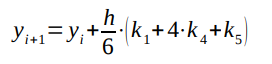
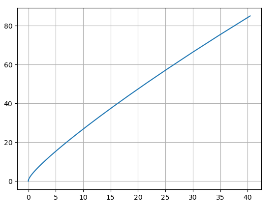

# Лабораторная работа № 7

Выполнил студент группы 428 
Шаров Федор Денисович

## Вариант № 09

## Теоретическая часть

Метод Мерсона является разновидностью пятиэтапных методов Рунге-Кутты 4-го порядка. Он определяется следующими выражениями:

## Практическая часть

В prog.cpp:
* Функция double f(double x, double y, double z, double g) возвращает значение f(x, y, z, g) = y''' , где z = y', g = y''
* Функции k1, k2, k3, k4, k5 возвращают значения одноименных коэффициентов
* Функция twice возвращет значение 
* Функция once возвращет значение 

prog.cpp при запуске запрашивает начальный шаг h, после выводит новый шаг, который находится после выполнения программы.
Создает 4 txt файла, которые будут использоваться в .py файлах.

y(x).py, y'(x).py, y'(y).py, y''(y').py файлы выводят соответствующие графики.

### Результаты

В результате работы программы у задачи Коши

было найдены решения на интервале [0;2] методом Мерсона с точностью 0.01. Ниже приведены рисунки графиков решиние y(x), y'(x) и фазовых траекторий:

